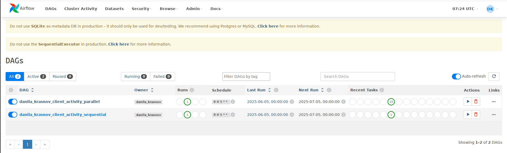
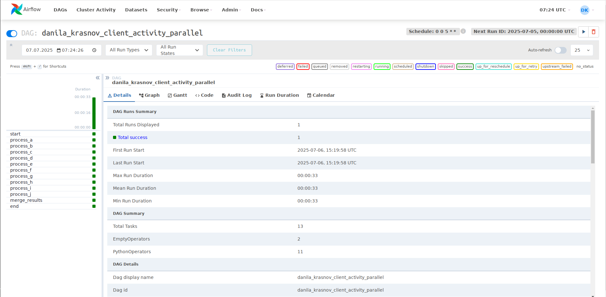
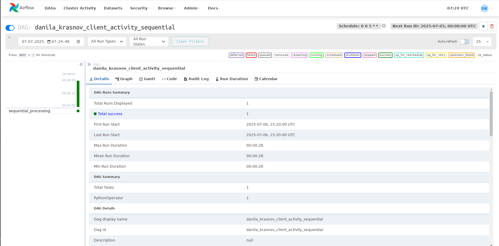
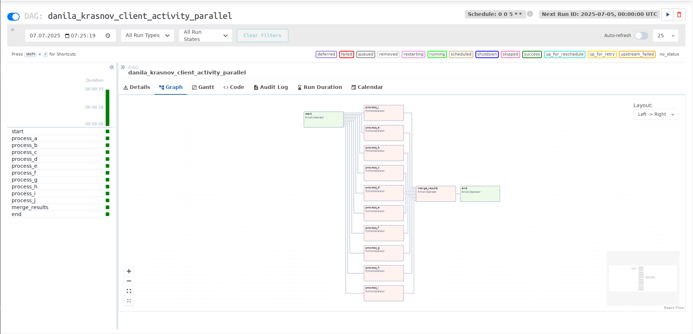

# Отчёт по заданию: ETL-процесс в Apache Airflow 
# Краснов Данила

## Описание решения

Реализован DAG для ежемесячного расчёта активности клиентов на основе транзакционных данных. Процесс включает:

1. **Extract**: Загрузка данных из CSV-файла
2. **Transform**: Расчет флагов активности по 10 продуктам
3. **Load**: Сохранение результатов с сохранением истории

## Структура проекта

```text
MLOPS_PROJECT/
├── dags/                     # DAG-файлы Airflow
│   ├── client_activity_par.py  # Параллельная версия
│   ├── client_activity_seq.py  # Последовательная версия
│   └── transform_script.py     # Логика трансформации
├── data/                     # Исходные и результирующие данные
│   ├── profit_table.csv       # Исходные данные транзакций (нет в репозитории из-за объема таблицы)
│   ├── flags_activity.csv     # Результаты (основной)
│   └── flags_activity_parallel.csv # Результаты (параллельный)
└── screenshots/ # скриншоты выполнения
```
## Скриншоты **DAG** с **AIRFLOW** 

### 1. Главная страница Airflow


### 2. Последовательный DAG


### 3. Параллельный DAG


